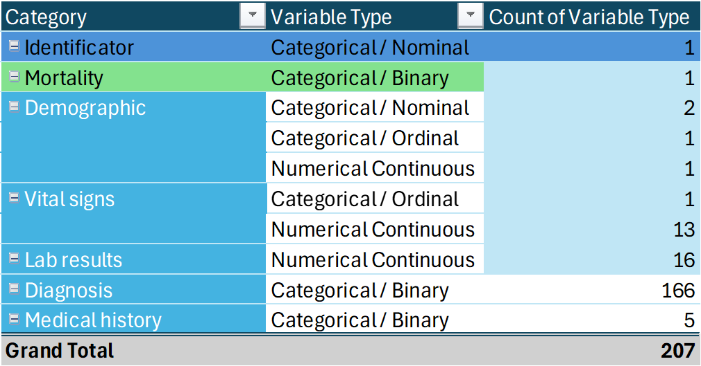

# MIMIC-IV

The objective of this project is to prepare clean data to predict if a patient will die or survive after 28 days after entering in the intensive care unit, we used public data MIMIC-IV to perform this exercise.

MIMIC-IV dataset contains:
* 6037 observations
* 207 variables
* Mortality is TARGET variable
* 34 features

